# Báo cáo thiết kế cơ sở dữ liệu website AmaTrung

Tài liệu này phục vụ mục **2.2.3. Thiết kế cơ sở dữ liệu** trong báo cáo khóa luận. Kết quả được tổng hợp từ `database/migrations`, `app/Models`, quan hệ Eloquent, `routes/web.php`, các controller đang được route sử dụng và schema MySQL hiện tại của database `db_amatrung`.

Phạm vi kiểm tra: chỉ đọc và tổng hợp. Không sửa code, không sửa migration, không chạy migration, không thay đổi dữ liệu.

## 1. Tổng quan cơ sở dữ liệu

### 1.1. Tổng số bảng hiện có

Database hiện tại có **40 bảng**.

### 1.2. Danh sách toàn bộ bảng

| STT | Tên bảng |
| --: | -------- |
| 1 | `ai_suggestion_logs` |
| 2 | `appointments` |
| 3 | `article_likes` |
| 4 | `articles` |
| 5 | `cache` |
| 6 | `cache_locks` |
| 7 | `comments` |
| 8 | `contact_messages` |
| 9 | `failed_jobs` |
| 10 | `herb_dictionary_entries` |
| 11 | `herb_dictionary_favorites` |
| 12 | `herb_dictionary_images` |
| 13 | `inventory_batches` |
| 14 | `inventory_items` |
| 15 | `job_batches` |
| 16 | `jobs` |
| 17 | `medical_record_attachments` |
| 18 | `medical_records` |
| 19 | `medicinal_herb_stock_logs` |
| 20 | `medicinal_herbs` |
| 21 | `migrations` |
| 22 | `model_has_permissions` |
| 23 | `model_has_roles` |
| 24 | `packaged_products` |
| 25 | `password_reset_tokens` |
| 26 | `patient_user_links` |
| 27 | `patients` |
| 28 | `permissions` |
| 29 | `prescription_items` |
| 30 | `prescriptions` |
| 31 | `retail_order_items` |
| 32 | `retail_orders` |
| 33 | `role_has_permissions` |
| 34 | `roles` |
| 35 | `sample_prescription_items` |
| 36 | `sample_prescriptions` |
| 37 | `sessions` |
| 38 | `stock_movements` |
| 39 | `therapy_services` |
| 40 | `users` |

### 1.3. Phân loại bảng

#### Bảng nghiệp vụ chính cần đưa vào báo cáo

Các bảng nên đưa vào phần chính của mục thiết kế cơ sở dữ liệu và từ điển dữ liệu:

- `users`
- `roles`
- `permissions`
- `model_has_roles`
- `model_has_permissions`
- `role_has_permissions`
- `patients`
- `patient_user_links`
- `medical_records`
- `medical_record_attachments`
- `prescriptions`
- `prescription_items`
- `therapy_services`
- `appointments`
- `inventory_items`
- `inventory_batches`
- `stock_movements`
- `articles`
- `comments`
- `article_likes`
- `herb_dictionary_entries`
- `herb_dictionary_images`
- `herb_dictionary_favorites`
- `ai_suggestion_logs`

#### Bảng hỗ trợ/mở rộng có thể ghi ngắn

- `contact_messages`: lưu thông tin liên hệ/yêu cầu hỗ trợ từ người dùng.
- `article_likes`: bảng phụ cho chức năng thích bài viết.
- `herb_dictionary_favorites`: bảng phụ cho chức năng lưu mục từ điển yêu thích.
- `patient_user_links`: bảng liên kết tài khoản người dùng với hồ sơ bệnh nhân; có thể đưa vào phần chính nếu báo cáo mô tả luồng người dùng tự liên kết hồ sơ.

#### Bảng hệ thống Laravel không cần đưa chi tiết

- `migrations`
- `cache`
- `cache_locks`
- `jobs`
- `job_batches`
- `failed_jobs`
- `sessions`
- `password_reset_tokens`

#### Bảng legacy/cũ/chỉ giữ tương thích

- `medicinal_herbs`: kho dược liệu cũ theo tổng số lượng. Thiết kế kho chính hiện tại nên trình bày theo `inventory_items`, `inventory_batches`, `stock_movements`.
- `medicinal_herb_stock_logs`: nhật ký kho cũ gắn với `medicinal_herbs`.
- `packaged_products`: bảng sản phẩm đóng gói/trà thảo mộc cũ, còn dùng cho tương thích một số luồng cũ.
- `retail_orders`, `retail_order_items`: bảng bán lẻ cũ, hiện không thấy route bán lẻ active trong `routes/web.php`.
- `sample_prescriptions`, `sample_prescription_items`: dữ liệu bài thuốc mẫu/hỗ trợ, không phải trọng tâm của luồng điều trị chính.

## 2. Danh sách bảng chính nên đưa vào từ điển dữ liệu

Nên đưa các bảng sau vào phần **Từ điển dữ liệu**:

1. `users`
2. `roles`
3. `permissions`
4. `model_has_roles`
5. `model_has_permissions`
6. `role_has_permissions`
7. `patients`
8. `patient_user_links`
9. `medical_records`
10. `medical_record_attachments`
11. `prescriptions`
12. `prescription_items`
13. `therapy_services`
14. `appointments`
15. `inventory_items`
16. `inventory_batches`
17. `stock_movements`
18. `articles`
19. `comments`
20. `article_likes`
21. `herb_dictionary_entries`
22. `herb_dictionary_images`
23. `herb_dictionary_favorites`
24. `ai_suggestion_logs`

Nếu cần mô tả phần liên hệ, có thể thêm `contact_messages` ở phụ lục hoặc mô tả ngắn.

## 3. Phân nhóm dữ liệu chính

| STT | Nhóm dữ liệu | Các bảng tiêu biểu | Chức năng phục vụ | Có đưa vào báo cáo chính không |
| --: | ------------ | ------------------ | ----------------- | ------------------------------ |
| 1 | Tài khoản và phân quyền | `users`, `roles`, `permissions`, `model_has_roles`, `model_has_permissions`, `role_has_permissions` | Quản lý đăng nhập, vai trò admin/staff/user và quyền thao tác | Có |
| 2 | Bệnh nhân và hồ sơ bệnh án | `patients`, `patient_user_links`, `medical_records`, `medical_record_attachments` | Quản lý thông tin bệnh nhân, lần khám, triệu chứng, chẩn đoán, file đính kèm | Có |
| 3 | Đơn điều trị và dịch vụ trị liệu | `prescriptions`, `prescription_items`, `therapy_services` | Lập đơn điều trị, ghi hạng mục thuốc/dịch vụ, hướng dẫn sử dụng | Có |
| 4 | Kho dược liệu theo lô | `inventory_items`, `inventory_batches`, `stock_movements` | Quản lý mặt hàng kho, lô hàng, hạn dùng, nhập-xuất-tồn theo FEFO | Có |
| 5 | Lịch hẹn | `appointments` | Đặt lịch hẹn/tái khám cho bệnh nhân | Có |
| 6 | Bài viết và bình luận | `articles`, `comments`, `article_likes` | Đăng bài viết, bình luận, duyệt bình luận, thích bài viết | Có |
| 7 | Từ điển dược liệu | `herb_dictionary_entries`, `herb_dictionary_images`, `herb_dictionary_favorites` | Tra cứu cây/ vị thuốc, ảnh minh họa, lưu yêu thích | Có |
| 8 | Trí tuệ nhân tạo | `ai_suggestion_logs`, các trường liên quan trong `medical_records`, `prescriptions.ai_suggestion` | Lưu nhật ký AI hỗ trợ nhận định sơ bộ và gợi ý điều trị tham khảo | Có |
| 9 | Liên hệ/yêu cầu hỗ trợ | `contact_messages` | Nhận lời nhắn liên hệ từ người dùng | Có thể ghi ngắn/phụ lục |
| 10 | Hệ thống/legacy | `migrations`, `cache`, `jobs`, `sessions`, `medicinal_herbs`, `packaged_products`, `retail_orders`, `sample_prescriptions`... | Hỗ trợ framework hoặc giữ tương thích chức năng cũ | Không đưa chi tiết vào phần chính |

## 4. Từ điển dữ liệu rút gọn cho các bảng chính

### 4.1. Bảng `users`

| STT | Tên trường | Kiểu dữ liệu | Ràng buộc | Ý nghĩa |
| --: | ---------- | ------------ | --------- | ------- |
| 1 | `id` | bigint unsigned | Khóa chính, auto increment | Mã định danh tài khoản |
| 2 | `name` | varchar(100) | Not null | Họ tên người dùng |
| 3 | `email` | varchar(150) | Unique, nullable | Email đăng nhập/liên hệ |
| 4 | `phone` | varchar(15) | Unique, nullable | Số điện thoại người dùng |
| 5 | `password` | varchar(255) | Not null | Mật khẩu đã băm |
| 6 | `avatar` | varchar(255) | Nullable | Đường dẫn ảnh đại diện |
| 7 | `role` | enum(`admin`, `staff`, `user`) | Not null, default `user` | Vai trò cơ bản của tài khoản |
| 8 | `legacy_permissions_json` | longtext/json | Nullable | Quyền cũ dạng JSON, giữ tương thích |
| 9 | `is_active` | tinyint | Not null, default 1 | Trạng thái kích hoạt/khóa tài khoản |
| 10 | `reset_code`, `reset_code_expires_at` | varchar(6), timestamp | Nullable | Mã OTP và hạn đặt lại mật khẩu |
| 11 | `created_at`, `updated_at` | timestamp | Nullable | Thời điểm tạo và cập nhật |

Ghi chú: hệ thống dùng kết hợp `users.role` và Spatie Permission. Staff là nhân viên/tài khoản được cấp quyền, không nên tự động diễn giải là thầy thuốc chuyên môn.

### 4.2. Bảng `roles`

| STT | Tên trường | Kiểu dữ liệu | Ràng buộc | Ý nghĩa |
| --: | ---------- | ------------ | --------- | ------- |
| 1 | `id` | bigint unsigned | Khóa chính, auto increment | Mã vai trò |
| 2 | `name` | varchar(255) | Unique cùng `guard_name` | Tên vai trò, ví dụ admin/staff |
| 3 | `guard_name` | varchar(255) | Not null | Guard xác thực của Laravel |
| 4 | `created_at`, `updated_at` | timestamp | Nullable | Thời điểm tạo và cập nhật |

### 4.3. Bảng `permissions`

| STT | Tên trường | Kiểu dữ liệu | Ràng buộc | Ý nghĩa |
| --: | ---------- | ------------ | --------- | ------- |
| 1 | `id` | bigint unsigned | Khóa chính, auto increment | Mã quyền |
| 2 | `name` | varchar(255) | Unique cùng `guard_name` | Tên quyền thao tác, ví dụ xem bệnh án, quản lý kho, dùng AI |
| 3 | `guard_name` | varchar(255) | Not null | Guard xác thực của Laravel |
| 4 | `created_at`, `updated_at` | timestamp | Nullable | Thời điểm tạo và cập nhật |

### 4.4. Bảng `model_has_roles`

| STT | Tên trường | Kiểu dữ liệu | Ràng buộc | Ý nghĩa |
| --: | ---------- | ------------ | --------- | ------- |
| 1 | `role_id` | bigint unsigned | Khóa chính phức hợp, FK đến `roles.id`, cascade delete | Vai trò được gán |
| 2 | `model_type` | varchar(255) | Khóa chính phức hợp | Loại model được gán vai trò, thường là `App\Models\User` |
| 3 | `model_id` | bigint unsigned | Khóa chính phức hợp, có index | ID của model được gán vai trò; với user thì tương ứng `users.id` |

### 4.5. Bảng `model_has_permissions`

| STT | Tên trường | Kiểu dữ liệu | Ràng buộc | Ý nghĩa |
| --: | ---------- | ------------ | --------- | ------- |
| 1 | `permission_id` | bigint unsigned | Khóa chính phức hợp, FK đến `permissions.id`, cascade delete | Quyền được gán trực tiếp |
| 2 | `model_type` | varchar(255) | Khóa chính phức hợp | Loại model được gán quyền |
| 3 | `model_id` | bigint unsigned | Khóa chính phức hợp, có index | ID của model được gán quyền |

### 4.6. Bảng `role_has_permissions`

| STT | Tên trường | Kiểu dữ liệu | Ràng buộc | Ý nghĩa |
| --: | ---------- | ------------ | --------- | ------- |
| 1 | `permission_id` | bigint unsigned | Khóa chính phức hợp, FK đến `permissions.id`, cascade delete | Quyền thuộc vai trò |
| 2 | `role_id` | bigint unsigned | Khóa chính phức hợp, FK đến `roles.id`, cascade delete | Vai trò được gán quyền |

### 4.7. Bảng `patients`

| STT | Tên trường | Kiểu dữ liệu | Ràng buộc | Ý nghĩa |
| --: | ---------- | ------------ | --------- | ------- |
| 1 | `id` | bigint unsigned | Khóa chính, auto increment | Mã định danh bệnh nhân |
| 2 | `patient_code` | varchar(20) | Unique, not null | Mã bệnh nhân dạng BN0001 |
| 3 | `user_id` | bigint unsigned | FK đến `users.id`, nullable, set null khi xóa user | Tài khoản người dùng liên kết nếu có |
| 4 | `full_name` | varchar(100) | Not null | Họ tên bệnh nhân |
| 5 | `phone` | varchar(15) | Nullable | Số điện thoại liên hệ |
| 6 | `date_of_birth` | date | Nullable | Ngày sinh |
| 7 | `gender` | enum(`male`, `female`, `other`) | Nullable | Giới tính |
| 8 | `address` | text | Nullable | Địa chỉ |
| 9 | `guardian_name`, `guardian_phone`, `relationship` | varchar | Nullable | Thông tin người thân/người giám hộ |
| 10 | `note` | text | Nullable | Ghi chú về bệnh nhân |
| 11 | `is_legacy_data` | tinyint | Not null, default 0 | Đánh dấu dữ liệu cũ được nhập lại |
| 12 | `legacy_source`, `legacy_note`, `legacy_date` | varchar/text/date | Nullable | Nguồn, ghi chú và ngày hồ sơ cũ |
| 13 | `imported_at`, `imported_by` | timestamp, bigint unsigned | Nullable | Thời điểm và người nhập dữ liệu cũ |
| 14 | `created_at`, `updated_at` | timestamp | Nullable | Thời điểm tạo và cập nhật |

### 4.8. Bảng `patient_user_links`

| STT | Tên trường | Kiểu dữ liệu | Ràng buộc | Ý nghĩa |
| --: | ---------- | ------------ | --------- | ------- |
| 1 | `id` | bigint unsigned | Khóa chính, auto increment | Mã liên kết |
| 2 | `patient_id` | bigint unsigned | FK đến `patients.id`, cascade delete | Hồ sơ bệnh nhân được liên kết |
| 3 | `user_id` | bigint unsigned | FK đến `users.id`, cascade delete; unique cùng `patient_id` | Tài khoản người dùng liên kết |
| 4 | `relationship_type` | varchar(255) | Nullable | Kiểu quan hệ, ví dụ bản thân/người thân |
| 5 | `is_verified` | tinyint | Not null, default 0 | Trạng thái đã xác minh liên kết |
| 6 | `created_at`, `updated_at` | timestamp | Nullable | Thời điểm tạo và cập nhật |

### 4.9. Bảng `medical_records`

| STT | Tên trường | Kiểu dữ liệu | Ràng buộc | Ý nghĩa |
| --: | ---------- | ------------ | --------- | ------- |
| 1 | `id` | bigint unsigned | Khóa chính, auto increment | Mã hồ sơ bệnh án |
| 2 | `record_code` | varchar(20) | Unique, nullable | Mã bệnh án dạng BA0001 |
| 3 | `patient_id` | bigint unsigned | FK đến `patients.id`, cascade delete | Bệnh nhân của lần khám |
| 4 | `staff_id` | bigint unsigned | FK đến `users.id` | Nhân viên/tài khoản phụ trách tạo hồ sơ |
| 5 | `visit_date` | date | Not null | Ngày khám |
| 6 | `weight`, `height` | decimal(5,1) | Nullable | Cân nặng, chiều cao tại lần khám |
| 7 | `symptoms` | text | Not null | Triệu chứng/lý do khám ban đầu |
| 8 | `diagnosis` | text | Not null | Chẩn đoán; có thể tạm lưu `Chưa chẩn đoán` khi mới nhập triệu chứng |
| 9 | `treatment_plan` | text | Nullable | Kế hoạch/phác đồ điều trị |
| 10 | `doctor_note` | text | Nullable | Ghi chú chuyên môn của thầy thuốc/admin |
| 11 | `case_type` | varchar(50) | Not null, default `general` | Loại ca khám: khám thường, xương khớp, kết hợp |
| 12 | `injury_type`, `injury_location`, `injury_cause` | varchar/text | Nullable | Thông tin chấn thương/vị trí/nguyên nhân với ca xương khớp |
| 13 | `clinical_signs`, `palpation_result`, `pain_level` | text/tinyint | Nullable | Dấu hiệu lâm sàng, kết quả thăm khám, mức độ đau 0-10 |
| 14 | `xray_image`, `xray_file_path`, `xray_note` | varchar/text | Nullable | Ảnh/phim chụp và ghi chú liên quan |
| 15 | `treatment_direction` | varchar(255) | Nullable | Hướng điều trị: uống thuốc, dùng ngoài, kết hợp, chuyển tuyến |
| 16 | `status` | varchar(255) | Not null, default `pending` | Trạng thái xử lý của bệnh án |
| 17 | `referral_reason` | varchar(255) | Nullable | Lý do chuyển tuyến nếu có |
| 18 | `allergies`, `underlying_diseases`, `current_medications` | text | Nullable | Dị ứng, bệnh nền, thuốc đang sử dụng |
| 19 | `is_legacy_data`, `legacy_source`, `legacy_note`, `imported_at`, `imported_by` | tinyint/varchar/text/timestamp/bigint | Nullable/default | Thông tin đánh dấu hồ sơ cũ nhập lại |
| 20 | `created_at`, `updated_at` | timestamp | Nullable | Thời điểm tạo và cập nhật |

Ghi chú nghiệp vụ mới: hệ thống cho phép lưu triệu chứng trước, sau đó Admin/Thầy thuốc chính hoặc người có quyền chỉnh sửa bệnh án có thể xác nhận chẩn đoán sau khi tham khảo AI. AI chỉ đưa ra nhận định tham khảo và được ghi log, không tự quyết định chẩn đoán.

### 4.10. Bảng `medical_record_attachments`

| STT | Tên trường | Kiểu dữ liệu | Ràng buộc | Ý nghĩa |
| --: | ---------- | ------------ | --------- | ------- |
| 1 | `id` | bigint unsigned | Khóa chính, auto increment | Mã file đính kèm |
| 2 | `medical_record_id` | bigint unsigned | FK đến `medical_records.id`, cascade delete | Bệnh án sở hữu file |
| 3 | `uploaded_by` | bigint unsigned | FK đến `users.id`, nullable, set null khi xóa user | Tài khoản tải file lên |
| 4 | `file_name` | varchar(255) | Not null | Tên file gốc |
| 5 | `file_path` | varchar(255) | Not null | Đường dẫn lưu trữ file |
| 6 | `file_type` | varchar(255) | Nullable | Định dạng/MIME type của file |
| 7 | `file_size` | int | Nullable | Kích thước file |
| 8 | `description` | text | Nullable | Mô tả ngắn cho file |
| 9 | `created_at`, `updated_at` | timestamp | Nullable | Thời điểm tạo và cập nhật |

### 4.11. Bảng `prescriptions`

| STT | Tên trường | Kiểu dữ liệu | Ràng buộc | Ý nghĩa |
| --: | ---------- | ------------ | --------- | ------- |
| 1 | `id` | bigint unsigned | Khóa chính, auto increment | Mã đơn điều trị |
| 2 | `medical_record_id` | bigint unsigned | FK đến `medical_records.id`, cascade delete | Bệnh án được lập đơn |
| 3 | `staff_id` | bigint unsigned | FK đến `users.id` | Tài khoản lập/xác nhận đơn |
| 4 | `treatment_type` | varchar(50) | Not null, default `combined` | Loại điều trị |
| 5 | `status` | varchar(30) | Not null, default `active` | Trạng thái đơn: active/confirmed/dispensed/cancelled tùy luồng xử lý |
| 6 | `note` | text | Nullable | Ghi chú chung |
| 7 | `public_instruction` | text | Nullable | Hướng dẫn in/trả cho bệnh nhân |
| 8 | `internal_note` | text | Nullable | Ghi chú nội bộ |
| 9 | `num_of_doses` | int unsigned | Not null, default 1 | Số thang/liều |
| 10 | `usage_instruction` | text | Nullable | Cách sắc/cách dùng thuốc |
| 11 | `course_days` | int unsigned | Nullable | Số ngày điều trị |
| 12 | `follow_up_date` | date | Nullable | Ngày hẹn tái khám |
| 13 | `ai_suggestion` | text | Nullable | Nội dung gợi ý AI nếu có, chỉ để tham khảo |
| 14 | `affect_stock` | tinyint | Not null, default 1 | Đơn có ảnh hưởng tồn kho hay không |
| 15 | `is_legacy_data`, `legacy_source`, `legacy_note` | tinyint/varchar/text | Nullable/default | Thông tin đơn cũ nhập lại |
| 16 | `created_at`, `updated_at` | timestamp | Nullable | Thời điểm tạo và cập nhật |

Ghi chú: việc lập đơn không đồng nghĩa với tự động trừ kho. Tồn kho được trừ khi người có quyền thực hiện thao tác xác nhận xuất thuốc.

### 4.12. Bảng `prescription_items`

| STT | Tên trường | Kiểu dữ liệu | Ràng buộc | Ý nghĩa |
| --: | ---------- | ------------ | --------- | ------- |
| 1 | `id` | bigint unsigned | Khóa chính, auto increment | Mã chi tiết đơn |
| 2 | `prescription_id` | bigint unsigned | FK đến `prescriptions.id`, cascade delete | Đơn điều trị chứa hạng mục |
| 3 | `inventory_item_id` | bigint unsigned | FK đến `inventory_items.id`, nullable, set null | Mặt hàng kho mới được dùng trong đơn |
| 4 | `medicinal_herb_id` | bigint unsigned | FK đến `medicinal_herbs.id`, nullable | Liên kết kho cũ, giữ tương thích |
| 5 | `packaged_product_id` | bigint unsigned | FK đến `packaged_products.id`, nullable, set null | Liên kết sản phẩm cũ, giữ tương thích |
| 6 | `item_type` | varchar(50) | Not null, default `oral_herb` | Loại hạng mục: thuốc, sản phẩm dùng ngoài, dịch vụ trị liệu |
| 7 | `custom_name` | varchar(255) | Nullable | Tên tùy chỉnh khi không gắn trực tiếp mặt hàng kho |
| 8 | `quantity_per_dose` | decimal(10,2) | Nullable | Số lượng mỗi thang/liều |
| 9 | `number_of_doses` | int | Nullable | Số thang/liều áp dụng cho hạng mục |
| 10 | `quantity` | decimal(10,2) | Not null | Tổng số lượng cần dùng/xuất |
| 11 | `unit` | varchar(50) | Nullable | Đơn vị tính |
| 12 | `dosage`, `usage_instruction` | varchar/text | Nullable | Hướng dẫn liều dùng/cách dùng |
| 13 | `note` | varchar(255) | Nullable | Ghi chú riêng cho hạng mục |
| 14 | `is_secret_formula` | tinyint | Not null, default 0 | Đánh dấu thành phần/công thức cần bảo mật nếu có |
| 15 | `affects_stock` | tinyint | Not null, default 1 | Hạng mục có trừ kho hay không |
| 16 | `usage_area`, `sessions` | varchar/int | Nullable | Vùng điều trị/số buổi với dịch vụ trị liệu |
| 17 | `created_at`, `updated_at` | timestamp | Nullable | Thời điểm tạo và cập nhật |

### 4.13. Bảng `therapy_services`

| STT | Tên trường | Kiểu dữ liệu | Ràng buộc | Ý nghĩa |
| --: | ---------- | ------------ | --------- | ------- |
| 1 | `id` | bigint unsigned | Khóa chính, auto increment | Mã dịch vụ trị liệu |
| 2 | `name` | varchar(150) | Unique, not null | Tên dịch vụ |
| 3 | `default_sessions` | int | Nullable, default 1 | Số buổi mặc định |
| 4 | `default_instruction` | text | Nullable | Hướng dẫn mặc định |
| 5 | `status` | varchar(50) | Not null, default `active` | Trạng thái dịch vụ |
| 6 | `created_at`, `updated_at` | timestamp | Nullable | Thời điểm tạo và cập nhật |

### 4.14. Bảng `appointments`

| STT | Tên trường | Kiểu dữ liệu | Ràng buộc | Ý nghĩa |
| --: | ---------- | ------------ | --------- | ------- |
| 1 | `id` | bigint unsigned | Khóa chính, auto increment | Mã lịch hẹn |
| 2 | `patient_id` | bigint unsigned | FK đến `patients.id`, cascade delete | Bệnh nhân được hẹn |
| 3 | `appointment_date` | date | Not null | Ngày hẹn |
| 4 | `appointment_time` | time | Not null | Giờ hẹn |
| 5 | `reason` | varchar(255) | Nullable | Lý do hẹn/tái khám |
| 6 | `status` | enum(`pending`, `confirmed`, `cancelled`, `completed`) | Not null, default `pending` | Trạng thái lịch hẹn |
| 7 | `notes` | text | Nullable | Ghi chú lịch hẹn |
| 8 | `created_at`, `updated_at` | timestamp | Nullable | Thời điểm tạo và cập nhật |

### 4.15. Bảng `inventory_items`

| STT | Tên trường | Kiểu dữ liệu | Ràng buộc | Ý nghĩa |
| --: | ---------- | ------------ | --------- | ------- |
| 1 | `id` | bigint unsigned | Khóa chính, auto increment | Mã mặt hàng kho |
| 2 | `name` | varchar(255) | Not null | Tên dược liệu/sản phẩm |
| 3 | `item_type` | varchar(255) | Not null | Loại mặt hàng: dược liệu, sản phẩm đóng gói, sản phẩm dùng ngoài |
| 4 | `unit` | varchar(255) | Nullable | Đơn vị tính |
| 5 | `description` | text | Nullable | Mô tả mặt hàng |
| 6 | `is_active` | tinyint | Not null, default 1 | Trạng thái đang sử dụng |
| 7 | `usage_route` | varchar(255) | Nullable | Đường/cách dùng: uống hoặc dùng ngoài |
| 8 | `warning_note` | text | Nullable | Cảnh báo/lưu ý khi dùng |
| 9 | `legacy_source_table`, `legacy_source_id` | varchar, bigint unsigned | Nullable, unique kết hợp | Thông tin liên kết nguồn dữ liệu cũ khi đồng bộ |
| 10 | `created_at`, `updated_at` | timestamp | Nullable | Thời điểm tạo và cập nhật |

Ghi chú: đây là bảng kho chính hiện tại, thay vì trình bày kho theo tổng số lượng trong `medicinal_herbs`.

### 4.16. Bảng `inventory_batches`

| STT | Tên trường | Kiểu dữ liệu | Ràng buộc | Ý nghĩa |
| --: | ---------- | ------------ | --------- | ------- |
| 1 | `id` | bigint unsigned | Khóa chính, auto increment | Mã lô kho |
| 2 | `inventory_item_id` | bigint unsigned | FK đến `inventory_items.id`, cascade delete | Mặt hàng thuộc lô |
| 3 | `batch_number` | varchar(255) | Nullable | Mã số lô |
| 4 | `expiry_date` | date | Nullable | Hạn sử dụng của lô |
| 5 | `quantity_remaining` | decimal(10,2) | Not null, default 0 | Số lượng còn lại của lô |
| 6 | `status` | varchar(255) | Not null, default `available` | Trạng thái lô: available, expired, blocked, unknown_expiry... |
| 7 | `created_at`, `updated_at` | timestamp | Nullable | Thời điểm tạo và cập nhật |

### 4.17. Bảng `stock_movements`

| STT | Tên trường | Kiểu dữ liệu | Ràng buộc | Ý nghĩa |
| --: | ---------- | ------------ | --------- | ------- |
| 1 | `id` | bigint unsigned | Khóa chính, auto increment | Mã giao dịch kho |
| 2 | `inventory_batch_id` | bigint unsigned | FK đến `inventory_batches.id`, cascade delete | Lô kho phát sinh giao dịch |
| 3 | `prescription_item_id` | bigint unsigned | FK đến `prescription_items.id`, nullable, set null | Hạng mục đơn điều trị liên quan nếu là xuất kho |
| 4 | `performed_by` | bigint unsigned | FK đến `users.id`, nullable, set null | Tài khoản thực hiện giao dịch |
| 5 | `movement_type` | varchar(255) | Not null | Loại giao dịch: import, dispense, adjustment, reverse... |
| 6 | `quantity` | decimal(10,2) | Not null | Số lượng tăng/giảm; xuất kho thường là số âm |
| 7 | `note` | text | Nullable | Ghi chú giao dịch kho |
| 8 | `created_at`, `updated_at` | timestamp | Nullable | Thời điểm tạo và cập nhật |

Ghi chú: xuất kho theo đơn dùng nguyên tắc FEFO. AI không tạo `stock_movements` và không tự trừ kho.

### 4.18. Bảng `articles`

| STT | Tên trường | Kiểu dữ liệu | Ràng buộc | Ý nghĩa |
| --: | ---------- | ------------ | --------- | ------- |
| 1 | `id` | bigint unsigned | Khóa chính, auto increment | Mã bài viết |
| 2 | `user_id` | bigint unsigned | FK đến `users.id` | Tác giả bài viết |
| 3 | `title` | varchar(255) | Not null | Tiêu đề bài viết |
| 4 | `summary` | text | Nullable | Tóm tắt bài viết |
| 5 | `slug` | varchar(255) | Unique, not null | Đường dẫn thân thiện |
| 6 | `content` | longtext | Not null | Nội dung bài viết |
| 7 | `featured_image` | varchar(255) | Nullable | Ảnh đại diện bài viết |
| 8 | `category` | varchar(100) | Nullable | Chuyên mục bài viết |
| 9 | `tags` | longtext/json | Nullable | Danh sách thẻ/từ khóa |
| 10 | `is_published` | tinyint | Not null, default 0 | Trạng thái xuất bản |
| 11 | `published_at` | timestamp | Nullable | Thời điểm đăng bài |
| 12 | `created_at`, `updated_at` | timestamp | Nullable | Thời điểm tạo và cập nhật |

### 4.19. Bảng `comments`

| STT | Tên trường | Kiểu dữ liệu | Ràng buộc | Ý nghĩa |
| --: | ---------- | ------------ | --------- | ------- |
| 1 | `id` | bigint unsigned | Khóa chính, auto increment | Mã bình luận |
| 2 | `article_id` | bigint unsigned | FK đến `articles.id`, cascade delete | Bài viết được bình luận |
| 3 | `user_id` | bigint unsigned | FK đến `users.id`, cascade delete | Người gửi bình luận |
| 4 | `content` | text | Not null | Nội dung bình luận |
| 5 | `rating` | tinyint | Nullable, default 5 | Điểm đánh giá nếu có |
| 6 | `is_approved` | tinyint | Not null, default 0 | Trạng thái duyệt bình luận |
| 7 | `created_at`, `updated_at` | timestamp | Nullable | Thời điểm tạo và cập nhật |

### 4.20. Bảng `article_likes`

| STT | Tên trường | Kiểu dữ liệu | Ràng buộc | Ý nghĩa |
| --: | ---------- | ------------ | --------- | ------- |
| 1 | `id` | bigint unsigned | Khóa chính, auto increment | Mã lượt thích |
| 2 | `article_id` | bigint unsigned | FK đến `articles.id`, cascade delete; unique cùng `user_id` | Bài viết được thích |
| 3 | `user_id` | bigint unsigned | FK đến `users.id`, cascade delete; unique cùng `article_id` | Người dùng thích bài viết |
| 4 | `created_at`, `updated_at` | timestamp | Nullable | Thời điểm tạo và cập nhật |

### 4.21. Bảng `herb_dictionary_entries`

| STT | Tên trường | Kiểu dữ liệu | Ràng buộc | Ý nghĩa |
| --: | ---------- | ------------ | --------- | ------- |
| 1 | `id` | bigint unsigned | Khóa chính, auto increment | Mã mục từ điển |
| 2 | `created_by` | bigint unsigned | FK đến `users.id`, nullable, set null | Tài khoản tạo mục từ điển |
| 3 | `name` | varchar(150) | Not null | Tên cây/vị thuốc |
| 4 | `slug` | varchar(180) | Unique, not null | Đường dẫn thân thiện |
| 5 | `scientific_name` | varchar(180) | Nullable | Tên khoa học |
| 6 | `other_names` | varchar(255) | Nullable | Tên gọi khác |
| 7 | `family` | varchar(150) | Nullable | Họ thực vật |
| 8 | `plant_part` | varchar(150) | Nullable | Bộ phận dùng |
| 9 | `properties` | varchar(255) | Nullable | Tính vị/đặc điểm cơ bản |
| 10 | `basic_info` | text | Nullable | Thông tin cơ bản |
| 11 | `effects` | text | Nullable | Công dụng/tác dụng tham khảo |
| 12 | `usage_notes` | text | Nullable | Cách dùng/lưu ý |
| 13 | `safety_warning` | text | Nullable | Cảnh báo an toàn |
| 14 | `status` | varchar(30) | Not null, default `published`, có index | Trạng thái published/draft |
| 15 | `created_at`, `updated_at` | timestamp | Nullable | Thời điểm tạo và cập nhật |

### 4.22. Bảng `herb_dictionary_images`

| STT | Tên trường | Kiểu dữ liệu | Ràng buộc | Ý nghĩa |
| --: | ---------- | ------------ | --------- | ------- |
| 1 | `id` | bigint unsigned | Khóa chính, auto increment | Mã ảnh |
| 2 | `entry_id` | bigint unsigned | FK đến `herb_dictionary_entries.id`, cascade delete | Mục từ điển sở hữu ảnh |
| 3 | `image_path` | varchar(500) | Not null | Đường dẫn ảnh |
| 4 | `caption` | varchar(255) | Nullable | Chú thích ảnh |
| 5 | `sort_order` | tinyint unsigned | Not null, default 0 | Thứ tự hiển thị |
| 6 | `created_at`, `updated_at` | timestamp | Nullable | Thời điểm tạo và cập nhật |

### 4.23. Bảng `herb_dictionary_favorites`

| STT | Tên trường | Kiểu dữ liệu | Ràng buộc | Ý nghĩa |
| --: | ---------- | ------------ | --------- | ------- |
| 1 | `id` | bigint unsigned | Khóa chính, auto increment | Mã lượt lưu yêu thích |
| 2 | `user_id` | bigint unsigned | FK đến `users.id`, cascade delete; unique cùng `entry_id` | Người dùng lưu yêu thích |
| 3 | `entry_id` | bigint unsigned | FK đến `herb_dictionary_entries.id`, cascade delete; unique cùng `user_id` | Mục từ điển được lưu |
| 4 | `created_at`, `updated_at` | timestamp | Nullable | Thời điểm tạo và cập nhật |

### 4.24. Bảng `ai_suggestion_logs`

| STT | Tên trường | Kiểu dữ liệu | Ràng buộc | Ý nghĩa |
| --: | ---------- | ------------ | --------- | ------- |
| 1 | `id` | bigint unsigned | Khóa chính, auto increment | Mã nhật ký AI |
| 2 | `user_id` | bigint unsigned | FK đến `users.id`, nullable, set null | Tài khoản gọi AI |
| 3 | `medical_record_id` | bigint unsigned | FK đến `medical_records.id`, nullable, set null | Bệnh án được AI hỗ trợ phân tích |
| 4 | `payload` | longtext/json | Not null | Dữ liệu gửi đến AI, đã được xử lý theo hướng không gửi trực tiếp từ request |
| 5 | `response` | longtext/json | Nullable | Kết quả AI trả về để tham khảo |
| 6 | `error_message` | text | Nullable | Thông tin lỗi nếu AI không sẵn sàng hoặc gọi thất bại |
| 7 | `status` | varchar(255) | Not null, default `pending` | Trạng thái log: pending, generated, failed, referenced, not_used |
| 8 | `created_at`, `updated_at` | timestamp | Nullable | Thời điểm tạo và cập nhật |

Ghi chú: bảng này dùng cho cả AI nhận định sơ bộ và AI gợi ý điều trị. AI chỉ hỗ trợ tham khảo; không tự tạo đơn, không tự cập nhật chẩn đoán nếu chưa được người có quyền xác nhận, và không tự trừ kho.

### 4.25. Bảng `contact_messages` (có thể đưa phụ lục)

| STT | Tên trường | Kiểu dữ liệu | Ràng buộc | Ý nghĩa |
| --: | ---------- | ------------ | --------- | ------- |
| 1 | `id` | bigint unsigned | Khóa chính, auto increment | Mã tin nhắn liên hệ |
| 2 | `name` | varchar(255) | Not null | Tên người gửi |
| 3 | `email` | varchar(255) | Not null | Email người gửi |
| 4 | `message` | text | Not null | Nội dung liên hệ |
| 5 | `status` | varchar(255) | Not null, default `pending` | Trạng thái xử lý tin nhắn |
| 6 | `created_at`, `updated_at` | timestamp | Nullable | Thời điểm tạo và cập nhật |

## 5. Các bảng không nên đưa chi tiết vào báo cáo chính

| Nhóm | Bảng | Lý do không nên trình bày chi tiết |
| ---- | ---- | ---------------------------------- |
| Hệ thống Laravel | `migrations`, `cache`, `cache_locks`, `jobs`, `job_batches`, `failed_jobs`, `sessions`, `password_reset_tokens` | Phục vụ framework, cache, session, queue, reset mật khẩu; không phải bảng nghiệp vụ |
| Kho cũ/tương thích | `medicinal_herbs`, `medicinal_herb_stock_logs` | Vẫn còn dữ liệu/route cũ, nhưng kho chính trong thiết kế hiện tại là `inventory_items`, `inventory_batches`, `stock_movements` |
| Sản phẩm đóng gói cũ | `packaged_products` | Giữ tương thích với route/dữ liệu cũ; đơn điều trị mới ưu tiên `inventory_items` |
| Bán lẻ cũ | `retail_orders`, `retail_order_items` | Không thấy route bán lẻ active trong `routes/web.php`; không nên xem là luồng chính |
| Bài thuốc mẫu | `sample_prescriptions`, `sample_prescription_items` | Dữ liệu mẫu/hỗ trợ, không phải trọng tâm nghiệp vụ điều trị chính |

## 6. Mô hình quan hệ dữ liệu chính

### 6.1. Danh sách bảng nên đưa vào Hình 2.8

Nên đưa vào **Hình 2.8. Mô hình quan hệ dữ liệu chính của website AmaTrung** các bảng sau:

- Tài khoản/phân quyền: `users`, `roles`, `permissions`, `model_has_roles`, `model_has_permissions`, `role_has_permissions`
- Bệnh nhân/bệnh án: `patients`, `patient_user_links`, `medical_records`, `medical_record_attachments`
- Đơn điều trị: `prescriptions`, `prescription_items`, `therapy_services`
- Kho theo lô: `inventory_items`, `inventory_batches`, `stock_movements`
- Bài viết/bình luận: `articles`, `comments`, `article_likes`
- Từ điển dược liệu: `herb_dictionary_entries`, `herb_dictionary_images`, `herb_dictionary_favorites`
- Lịch hẹn: `appointments`
- AI log: `ai_suggestion_logs`

Không nên đưa các bảng hệ thống Laravel vào ERD chính. Các bảng legacy như `medicinal_herbs`, `packaged_products`, `retail_orders`, `sample_prescriptions` chỉ nên đưa vào phụ lục nếu cần giải thích quá trình mở rộng/tương thích.

### 6.2. Mermaid ERD tham khảo

```mermaid
erDiagram
    USERS {
        bigint id PK
        string name
        string email UK
        string phone UK
        enum role
        boolean is_active
    }

    ROLES {
        bigint id PK
        string name
        string guard_name
    }

    PERMISSIONS {
        bigint id PK
        string name
        string guard_name
    }

    MODEL_HAS_ROLES {
        bigint role_id FK
        string model_type
        bigint model_id
    }

    MODEL_HAS_PERMISSIONS {
        bigint permission_id FK
        string model_type
        bigint model_id
    }

    ROLE_HAS_PERMISSIONS {
        bigint role_id FK
        bigint permission_id FK
    }

    PATIENTS {
        bigint id PK
        string patient_code UK
        bigint user_id FK
        string full_name
        string phone
    }

    PATIENT_USER_LINKS {
        bigint id PK
        bigint patient_id FK
        bigint user_id FK
        boolean is_verified
    }

    MEDICAL_RECORDS {
        bigint id PK
        string record_code UK
        bigint patient_id FK
        bigint staff_id FK
        date visit_date
        text symptoms
        text diagnosis
        string treatment_direction
        string status
    }

    MEDICAL_RECORD_ATTACHMENTS {
        bigint id PK
        bigint medical_record_id FK
        bigint uploaded_by FK
        string file_path
    }

    PRESCRIPTIONS {
        bigint id PK
        bigint medical_record_id FK
        bigint staff_id FK
        string treatment_type
        string status
        date follow_up_date
    }

    PRESCRIPTION_ITEMS {
        bigint id PK
        bigint prescription_id FK
        bigint inventory_item_id FK
        string item_type
        decimal quantity
        boolean affects_stock
    }

    THERAPY_SERVICES {
        bigint id PK
        string name UK
        int default_sessions
        string status
    }

    APPOINTMENTS {
        bigint id PK
        bigint patient_id FK
        date appointment_date
        time appointment_time
        string status
    }

    INVENTORY_ITEMS {
        bigint id PK
        string name
        string item_type
        string usage_route
        string unit
        boolean is_active
    }

    INVENTORY_BATCHES {
        bigint id PK
        bigint inventory_item_id FK
        string batch_number
        date expiry_date
        decimal quantity_remaining
        string status
    }

    STOCK_MOVEMENTS {
        bigint id PK
        bigint inventory_batch_id FK
        bigint prescription_item_id FK
        bigint performed_by FK
        string movement_type
        decimal quantity
    }

    ARTICLES {
        bigint id PK
        bigint user_id FK
        string title
        string slug UK
        boolean is_published
    }

    COMMENTS {
        bigint id PK
        bigint article_id FK
        bigint user_id FK
        text content
        boolean is_approved
    }

    ARTICLE_LIKES {
        bigint id PK
        bigint article_id FK
        bigint user_id FK
    }

    HERB_DICTIONARY_ENTRIES {
        bigint id PK
        bigint created_by FK
        string name
        string slug UK
        string status
    }

    HERB_DICTIONARY_IMAGES {
        bigint id PK
        bigint entry_id FK
        string image_path
        int sort_order
    }

    HERB_DICTIONARY_FAVORITES {
        bigint id PK
        bigint user_id FK
        bigint entry_id FK
    }

    AI_SUGGESTION_LOGS {
        bigint id PK
        bigint user_id FK
        bigint medical_record_id FK
        json payload
        json response
        string status
    }

    USERS ||--o{ PATIENTS : "user_id"
    USERS ||--o{ PATIENT_USER_LINKS : "user_id"
    PATIENTS ||--o{ PATIENT_USER_LINKS : "patient_id"

    USERS ||--o{ MEDICAL_RECORDS : "staff_id"
    PATIENTS ||--o{ MEDICAL_RECORDS : "patient_id"
    MEDICAL_RECORDS ||--o{ MEDICAL_RECORD_ATTACHMENTS : "attachments"
    USERS ||--o{ MEDICAL_RECORD_ATTACHMENTS : "uploaded_by"

    MEDICAL_RECORDS ||--o{ PRESCRIPTIONS : "prescriptions"
    USERS ||--o{ PRESCRIPTIONS : "staff_id"
    PRESCRIPTIONS ||--o{ PRESCRIPTION_ITEMS : "items"
    INVENTORY_ITEMS ||--o{ PRESCRIPTION_ITEMS : "inventory_item_id"

    INVENTORY_ITEMS ||--o{ INVENTORY_BATCHES : "batches"
    INVENTORY_BATCHES ||--o{ STOCK_MOVEMENTS : "movements"
    PRESCRIPTION_ITEMS ||--o{ STOCK_MOVEMENTS : "prescription_item_id"
    USERS ||--o{ STOCK_MOVEMENTS : "performed_by"

    PATIENTS ||--o{ APPOINTMENTS : "appointments"

    USERS ||--o{ ARTICLES : "author"
    ARTICLES ||--o{ COMMENTS : "comments"
    USERS ||--o{ COMMENTS : "comments"
    ARTICLES ||--o{ ARTICLE_LIKES : "likes"
    USERS ||--o{ ARTICLE_LIKES : "likes"

    USERS ||--o{ HERB_DICTIONARY_ENTRIES : "created_by"
    HERB_DICTIONARY_ENTRIES ||--o{ HERB_DICTIONARY_IMAGES : "images"
    HERB_DICTIONARY_ENTRIES ||--o{ HERB_DICTIONARY_FAVORITES : "favorites"
    USERS ||--o{ HERB_DICTIONARY_FAVORITES : "favorites"

    USERS ||--o{ AI_SUGGESTION_LOGS : "requests"
    MEDICAL_RECORDS ||--o{ AI_SUGGESTION_LOGS : "ai_logs"

    ROLES ||--o{ MODEL_HAS_ROLES : "role_id"
    USERS ||--o{ MODEL_HAS_ROLES : "model_id"
    PERMISSIONS ||--o{ MODEL_HAS_PERMISSIONS : "permission_id"
    USERS ||--o{ MODEL_HAS_PERMISSIONS : "model_id"
    ROLES ||--o{ ROLE_HAS_PERMISSIONS : "role_id"
    PERMISSIONS ||--o{ ROLE_HAS_PERMISSIONS : "permission_id"
```

Ghi chú cho ERD:

- `model_has_roles.model_id` và `model_has_permissions.model_id` là liên kết đa hình của Spatie. Trong hệ thống AmaTrung, khi `model_type = App\Models\User` thì có thể hiểu là liên kết đến `users.id`.
- `therapy_services` hiện là danh mục dịch vụ trị liệu. Khi lập đơn, dịch vụ có thể được ghi vào `prescription_items` bằng `item_type`, `custom_name`, `sessions`, `usage_instruction`; schema hiện tại chưa có khóa ngoại trực tiếp `therapy_service_id`.
- `ai_suggestion_logs` chỉ lưu nhật ký hỗ trợ AI, không tạo quan hệ trực tiếp đến kho hoặc đơn thuốc.

## 7. Bảng/luồng AI mới cần ghi đúng

Sau khi cập nhật AI hỗ trợ nhận định sơ bộ, các thành phần cần đưa vào báo cáo gồm:

- `ai_suggestion_logs`: lưu payload đã xử lý, kết quả trả về, trạng thái log và lỗi nếu có.
- `medical_records.diagnosis`: có thể ban đầu là `Chưa chẩn đoán`, sau đó được Admin/Thầy thuốc chính hoặc người có quyền chỉnh sửa bệnh án xác nhận.
- `medical_records.treatment_direction`: lưu hướng điều trị như uống thuốc, dùng ngoài, kết hợp, chuyển tuyến.
- `medical_records.status`: theo dõi trạng thái xử lý của bệnh án.
- `prescriptions.ai_suggestion`: chỉ là nội dung gợi ý tham khảo nếu có, không phải quyết định điều trị tự động.

Luồng đúng nên mô tả:

1. Nhân viên/Admin nhập thông tin bệnh án, tối thiểu có triệu chứng.
2. Nếu chưa có chẩn đoán chính thức, hệ thống có thể lưu `Chưa chẩn đoán`.
3. Người có quyền gọi AI để nhận nhận định sơ bộ hoặc gợi ý điều trị tham khảo.
4. Kết quả AI được ghi vào `ai_suggestion_logs`.
5. Admin/Thầy thuốc chính hoặc người được cấp quyền mới xác nhận/cập nhật chẩn đoán và quyết định đơn điều trị.
6. Kho chỉ bị trừ khi đơn đã được xác nhận xuất thuốc; AI không tự trừ kho.

## 8. Cảnh báo nội dung dễ ghi sai trong báo cáo

- Không ghi database chỉ có 8 bảng. Schema hiện tại có **40 bảng**.
- Không đưa toàn bộ bảng hệ thống Laravel vào ERD chính vì sẽ làm hình bị rối.
- Không ghi Staff là thầy thuốc. Staff là nhân viên/tài khoản được Admin cấp quyền; không tự động đồng nghĩa với thầy thuốc chuyên môn.
- Không ghi Staff tự quyết định chuyên môn nếu chưa được cấp quyền. Admin/Thầy thuốc chính mới là người quyết định chuyên môn trong báo cáo.
- Không ghi AI chẩn đoán bệnh tự động. AI chỉ hỗ trợ nhận định/gợi ý tham khảo.
- Không ghi AI kê đơn tự động. Đơn điều trị được lập và xác nhận bởi người dùng có quyền.
- Không ghi AI tự trừ kho. Kho chỉ bị trừ qua luồng xuất thuốc của `PrescriptionService` và ghi vào `stock_movements`.
- Không ghi kho chính là `medicinal_herbs` nếu đang trình bày thiết kế hiện tại. Kho chính nên trình bày theo `inventory_items`, `inventory_batches`, `stock_movements`.
- Không ghi đơn điều trị vừa tạo là đã trừ kho ngay. Hệ thống tạo đơn, sau đó cần thao tác xác nhận xuất thuốc để trừ tồn kho theo lô.
- Không trình bày `retail_orders` là luồng bán lẻ chính nếu route/chức năng bán lẻ không còn active.
- Không đưa `sample_prescriptions` thành nghiệp vụ điều trị chính. Đây là dữ liệu mẫu/hỗ trợ, có thể đưa phụ lục nếu cần.
- Không bỏ qua bảng phân quyền Spatie (`roles`, `permissions`, các bảng pivot), vì project không chỉ dùng mỗi cột `users.role`.
